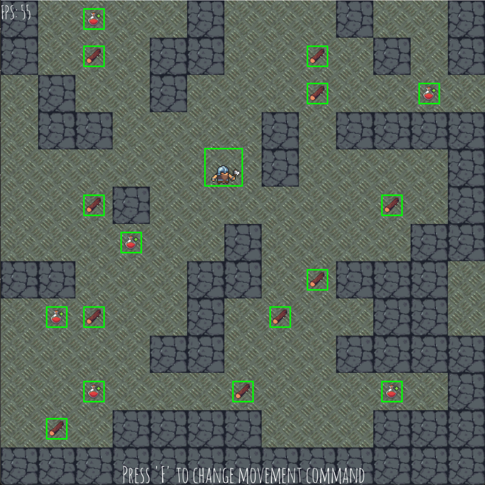
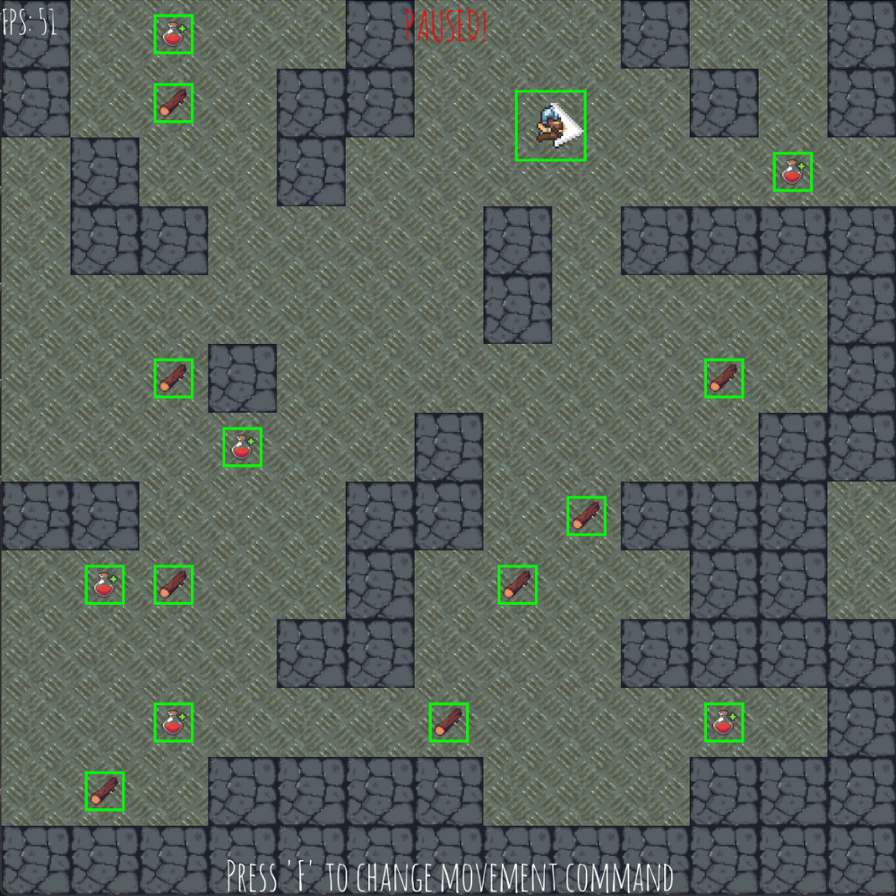
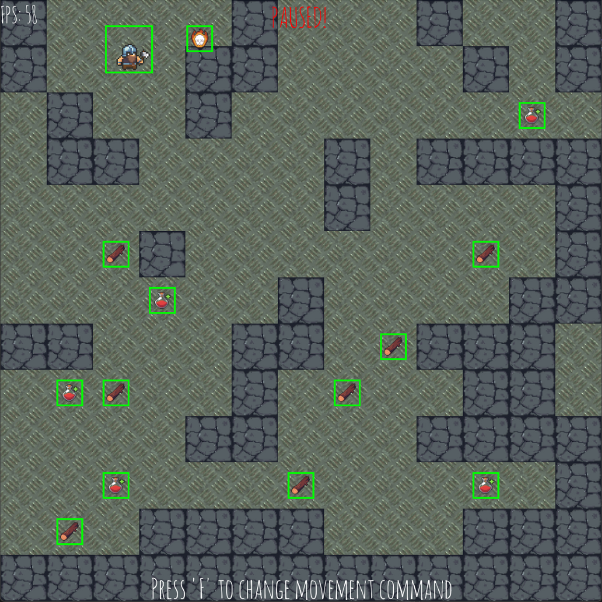
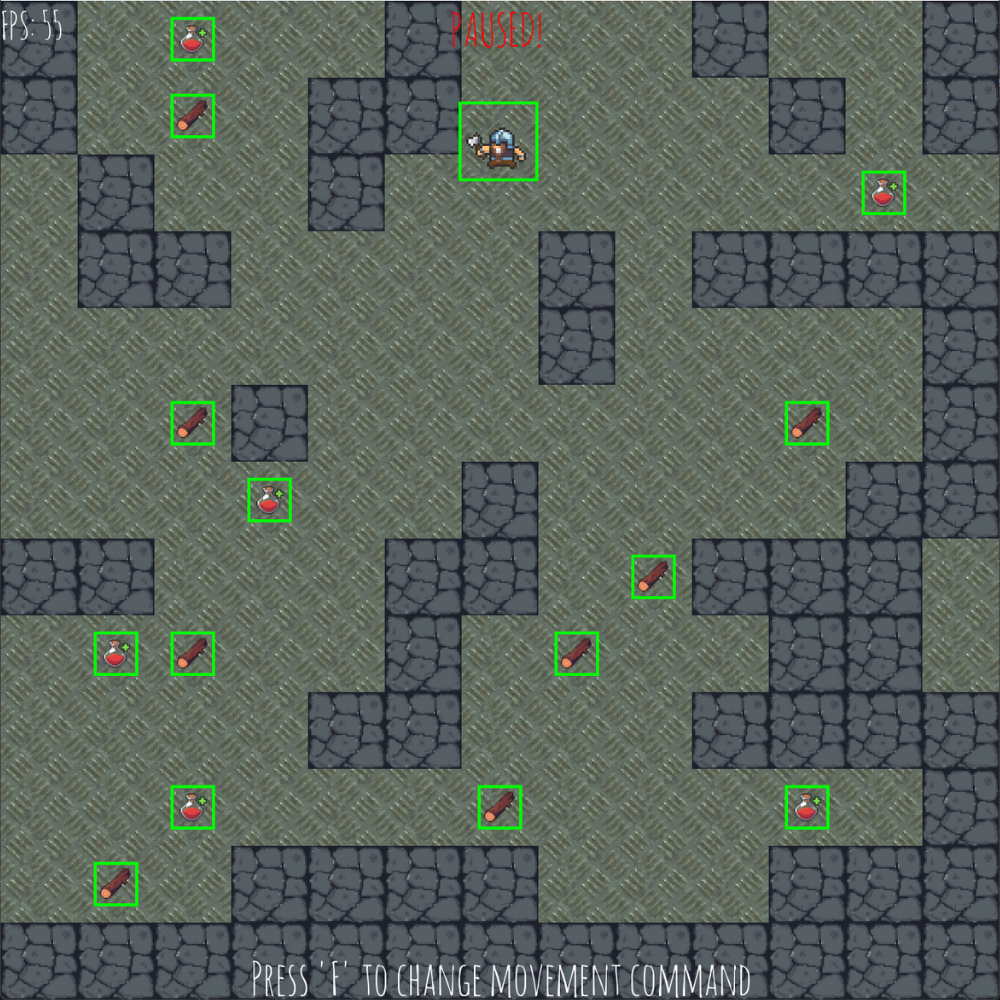

# 🎮 C++ Game Engine Demo with SFML & Game Programming Patterns

A simple mini game built using the [SFML](https://www.sfml-dev.org/) multimedia library. This project is designed to demonstrate several essential game programming patterns commonly used in real-time applications and game engines.

---

## 🚀 Features

- 🕹️ Built with **C++14** and **SFML**
- 📦 Modular architecture demonstrating multiple **Game Programming Patterns**
- 🎨 Simple game logic for demonstration & educational purposes

---

## 📘 Game Programming Patterns Implemented

This project serves as a living reference for the following patterns:

### 1. 🧠 Adaptive Game Loop

- **Purpose:** Maintain smooth and consistent gameplay across systems.
- **How it's used:** The game runs at a fixed update rate of **60 FPS**, ensuring deterministic physics and logic updates.
- **Benefits:** Decouples rendering and game logic updates, avoiding frame-dependent behavior.

### 2. 🧱 Entity Component System (ECS) with Big Array and Archetypes

- **Purpose:** High-performance, scalable game object architecture.
- **How it's used:** The ECS design uses **Big Arrays** to store component data contiguously in memory, optimized for cache locality.
- **Archetypes** organize entities by component composition to maximize iteration speed and minimize branching.
- **Benefits:** Greatly improves performance and maintainability over traditional inheritance hierarchies.

### 3. 🧵 Flyweight Pattern

- **Purpose:** Minimize memory usage and loading times.
- **How it's used:** Shared textures and other heavy resources are stored in a central repository. Entities reference these instead of loading them individually.
- **Benefits:** Reduces memory footprint and avoids redundant resource loading (e.g., all tree entities use a single texture instance).

### 4. 📡 Observer Pattern

- **Purpose:** Decouple event emitters from event listeners.
- **How it's used:** The `AchievementManager` subscribes to game events and tracks progress. When certain in-game actions are triggered (e.g., collecting items), the manager responds and updates achievements.
- **Benefits:** Promotes modular design and simplifies event tracking without hardcoding dependencies.

### 5. 🔁 Object Pool Pattern

- **Purpose:** Avoid performance hits from frequent memory allocation and deallocation.
- **How it's used:** Classes like `Fire`, `Log`, and `Potion` include an `inUse()` function to check pool availability. Instead of creating new objects during gameplay, existing ones are reused.
- **Benefits:** Smooth performance and reduced GC or heap allocation spikes.

### 6. 🔊 Service Locator Pattern

- **Purpose:** Provide global access to shared services without tight coupling.
- **How it's used:** The entire audio subsystem (sound effects, music) is accessed via a service locator. Game entities do not directly interact with audio APIs.
- **Benefits:** Easily swappable audio backends, testability, and decoupled architecture.

### 7. 💥 Collision Callbacks

- **Purpose:** Handle entity-specific collision logic flexibly.
- **How it's used:** When a collision is detected, the system checks the `EntityType` of the involved objects and dispatches a corresponding callback.
- **Benefits:** Clean separation between collision detection and response logic; supports extensibility.

### 8. 🎮 Command Pattern

- **Purpose:** Abstract and queue player actions for execution.
- **How it's used:** Player inputs (like move, attack, interact) are translated into `Command` objects and processed by the input system.
- **Benefits:** Simplifies input handling, supports undo, replay systems, and AI scripting.

Each pattern is implemented in isolation and integrated into the game loop where appropriate.

---

## 📸 Screenshots

  
  

  
  

  <em>Figure 1: gameplay scenes</em>

---

## 📚 References

* 📘 Game Programming Patterns by Robert Nystrom
* 📚 SFML Documentation: https://www.sfml-dev.org/documentation/
